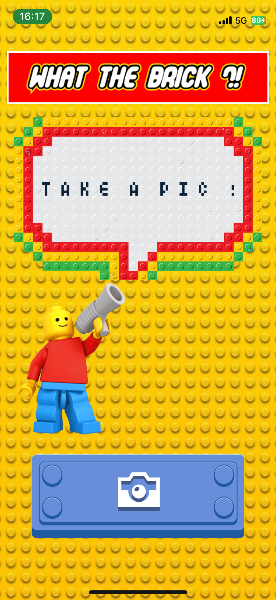

<p align="center">
    
</p>

## Introduction
What the F.. Brick ?! This tool is built using React Native, TensorFlow, and OpenCV to identify Lego bricks in a photograph and guess their types. It serves as a powerful tool for Lego enthusiasts and builders, offering a way to digitally catalog and recognize Lego pieces directly laying on a dark mat !

## Project Structure
- `views/`: Contains the different views of the application.
- `handlers/`: Contains API handling functions.
- `components/button/`: Contains the main button component.

## Getting Started

### Prerequisites
- Expo
- Node.js
- Other dependencies as listed in the `package.json` file.

### Installation
Clone the repository:
```bash
git clone https://github.com/thomas-rooty/what-the-brick.git
```

Install the required NPM packages:

```bash
npm i
```

### Running the app
Start the app:

```bash
npm run start
```

## Usage
### Detecting Lego Bricks

Send a POST request to /detect_legos with an image file. The API processes the image and returns bounding boxes around each detected Lego brick.

Example with curl:

```bash
curl -X POST -F "file=@path_to_your_image.jpg" http://api_url/detect_legos
```

### Guessing Lego Types

Send a POST request to /guess_lego with a list of URLs of cropped Lego brick images. The API uses a pre-trained model to predict the type of each Lego brick.

Example with curl:

```bash
curl -X POST -H "Content-Type: application/json" -d '{"urls": ["http://image_url1.jpg", "http://image_url2.jpg"]}' http://127.0.0.1:5000/guess_lego
```

## App preview

### Home page


### Contributing
We welcome contributions to improve the Lego Detector API! Whether it's bug fixes, feature enhancements, or documentation improvements, your help is valuable.
